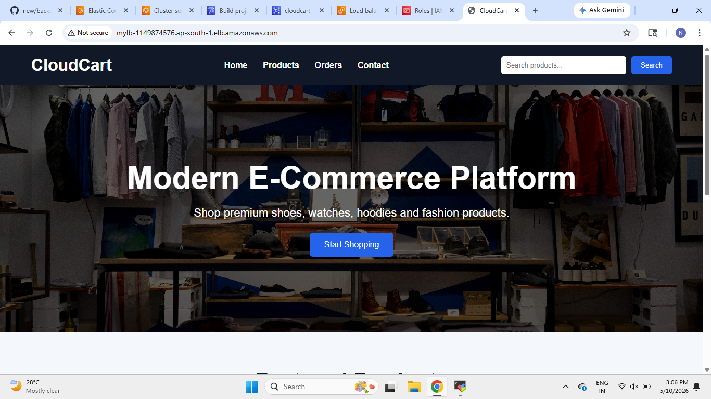
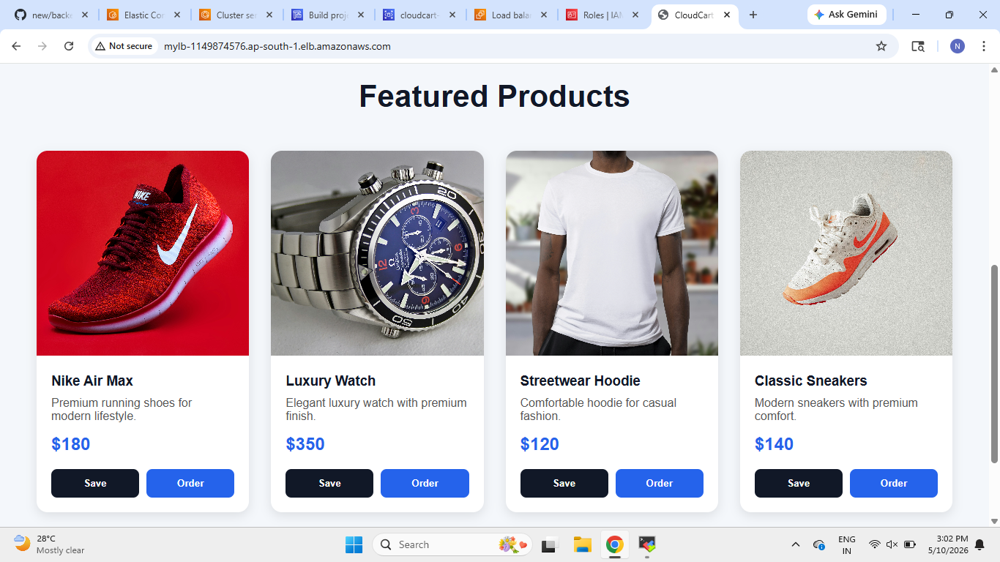
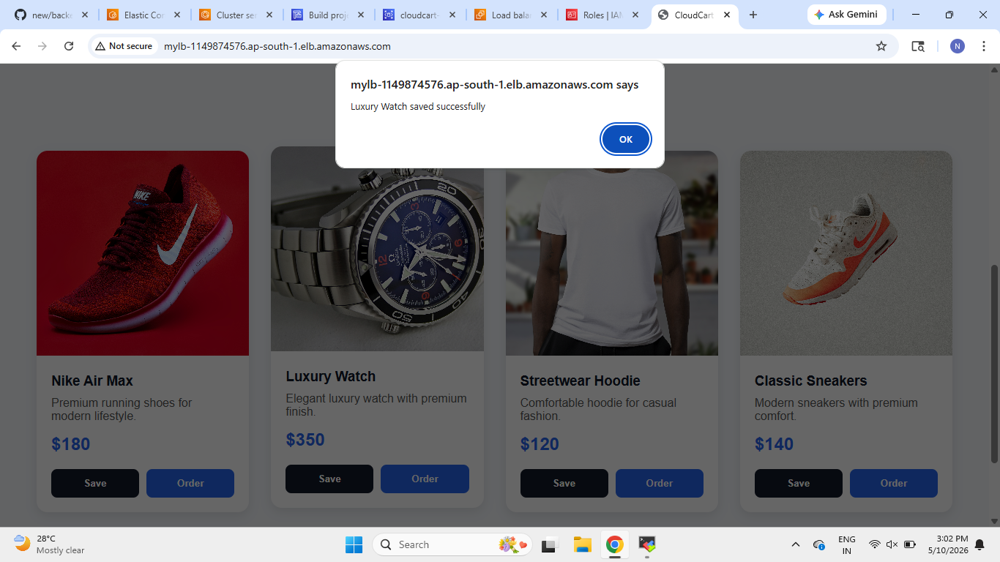
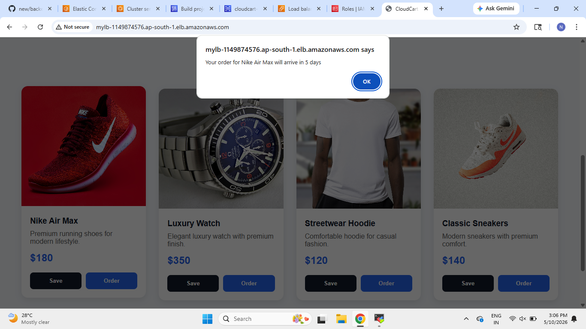
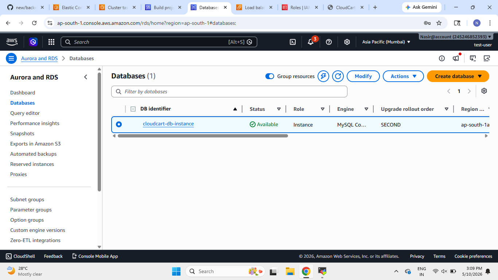
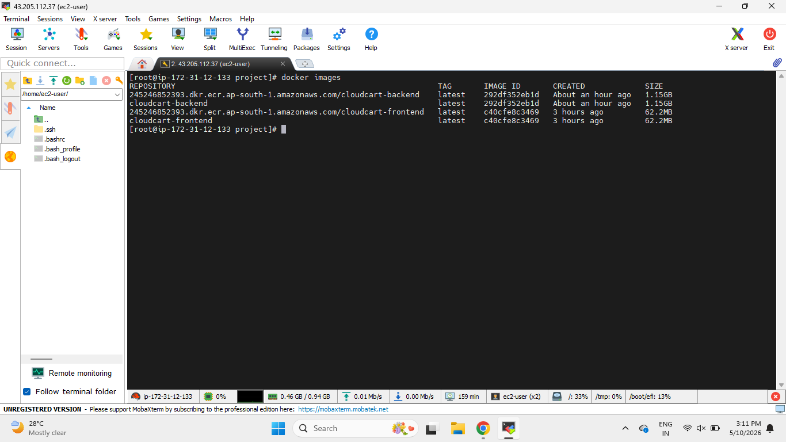
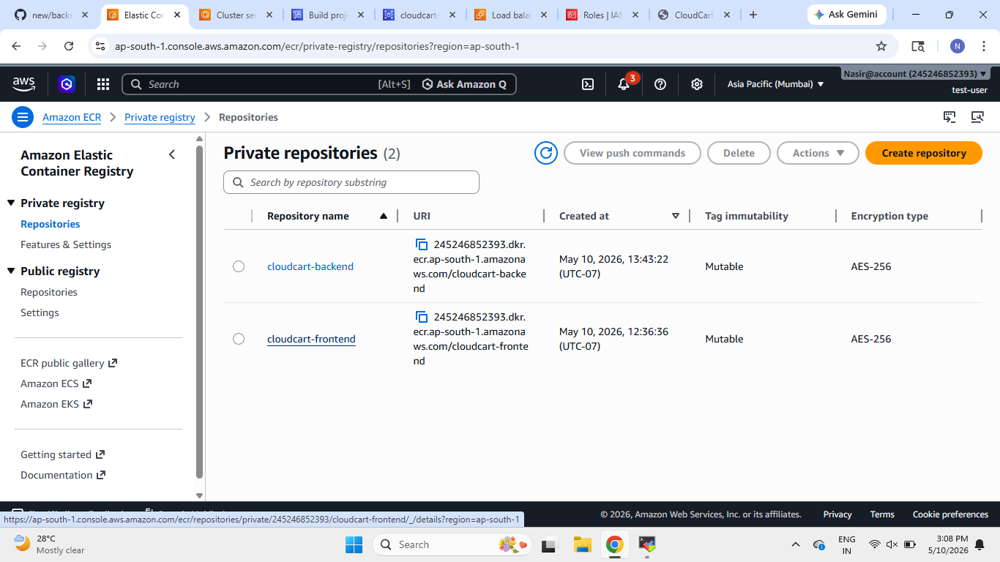
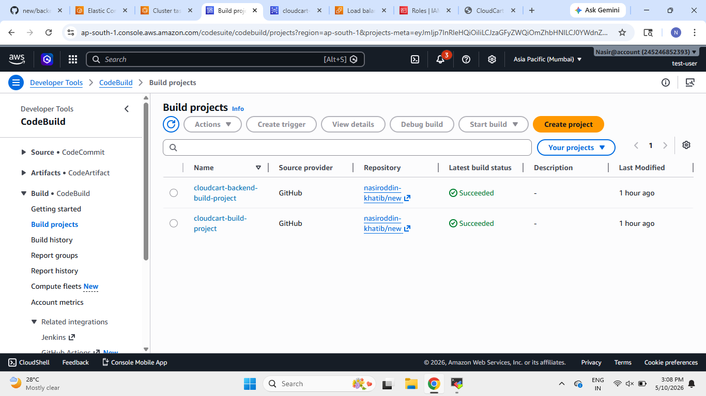
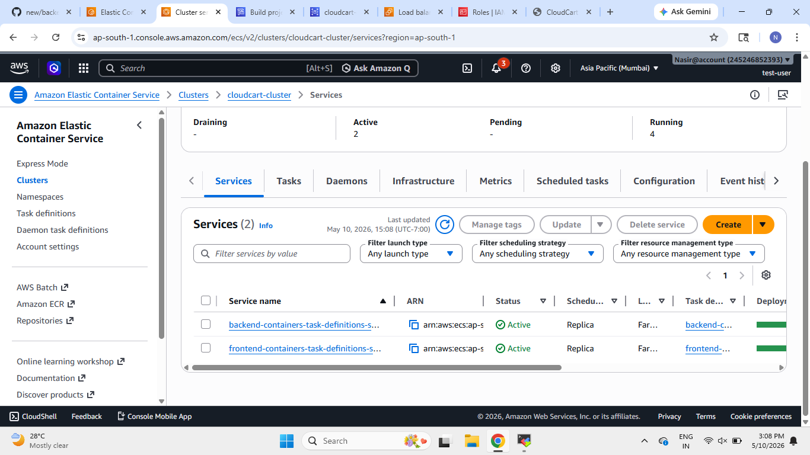

# ============================================================
# CloudCart - Full Stack E-Commerce Application Deployment
# ============================================================

## Project Overview

CloudCart is a full-stack e-commerce application deployed on AWS using a complete containerized DevOps workflow.

This project demonstrates:

- Frontend and Backend containerization using Docker
- automation using AWS CodeBuild
- Docker image storage using Amazon ECR
- Container orchestration using Amazon ECS Fargate
- Database integration using Amazon RDS MySQL
- Load balancing using Application Load Balancer (ALB)

The application allows users to:
- Browse products
- Search products
- Save products
- Place orders

All backend data is stored inside an Amazon RDS MySQL database.

---

# ============================================================
# Architecture
# ============================================================

```text
Developer Pushes Code to GitHub
                ↓
AWS CodeBuild Starts Automatically
                ↓
Docker Images Built for Frontend & Backend
                ↓
Images Pushed to Amazon ECR
                ↓
Amazon ECS Pulls Images from ECR
                ↓
Containers Run on ECS Fargate
                ↓
Backend Connects to Amazon RDS
                ↓
Application Exposed Through Load Balancer
```

---

# ============================================================
# Technologies Used
# ============================================================

## Frontend
- HTML
- CSS
- JavaScript
- Nginx

## Backend
- Node.js
- Express.js
- MySQL

## DevOps & AWS Services
- Docker
- AWS CodeBuild
- Amazon ECR
- Amazon ECS Fargate
- Amazon RDS
- Application Load Balancer
- GitHub

---

---

# ============================================================
# Application Screenshots
# ============================================================

## CloudCart Homepage

The homepage displays the main landing page of the e-commerce platform.



---

## Featured Products Section

Users can browse available products directly from the frontend application.



---

## Product Save Feature

When users save a product, the request is sent to the backend API and stored in the database.



---

## Product Order Feature

When users place an order, the backend API processes the request and stores order details in MySQL RDS.



---

# ============================================================
# Frontend Workflow
# ============================================================

The frontend application is built using:

- HTML
- CSS
- JavaScript

The frontend communicates with backend APIs using Fetch API requests.

Frontend features:
- Product display
- Product search
- Save product API call
- Order product API call

---

# ============================================================
# Frontend Docker Container
# ============================================================

The frontend application is containerized using Docker and served using Nginx.

### Frontend Docker Workflow

```text
Frontend Files
      ↓
Docker Build
      ↓
Nginx Container
      ↓
Amazon ECR
      ↓
Amazon ECS
```

---

# ============================================================
# Backend Workflow
# ============================================================

The backend application is built using:

- Node.js
- Express.js
- MySQL

Backend responsibilities:
- Handle API requests
- Connect with RDS database
- Store orders
- Store saved products
- Manage users

---

# ============================================================
# Database Integration
# ============================================================

The backend connects with Amazon RDS MySQL using Sequelize ORM.

### Amazon RDS Database



The database stores:
- User information
- Product orders
- Saved products

---

# ============================================================
# Backend Database Connection
# ============================================================

The backend uses environment variables for database connectivity.

### Backend Database Connection Flow

```text
Node.js Backend
       ↓
Sequelize ORM
       ↓
Amazon RDS MySQL
```

The application authenticates with MySQL and synchronizes database tables automatically.

---

# ============================================================
# Docker Image Build Process
# ============================================================

Docker images are built separately for frontend and backend services.

### Local Docker Images



Docker images:
- cloudcart-frontend
- cloudcart-backend

---

# ============================================================
# Amazon ECR Repositories
# ============================================================

After Docker images are built, they are pushed to Amazon Elastic Container Registry (ECR).

### Amazon ECR



ECR acts as the centralized container image repository.

---

# ============================================================
# AWS CodeBuild Automation
# ============================================================

AWS CodeBuild automatically builds Docker images after source code updates.

### AWS CodeBuild Projects



Two separate build projects are used:
- Frontend Build Project
- Backend Build Project

---

# ============================================================
# Frontend Build Workflow
# ============================================================

The frontend build process performs:

1. Login to Amazon ECR
2. Build frontend Docker image
3. Tag Docker image
4. Push image to Amazon ECR

---

# ============================================================
# Backend Build Workflow
# ============================================================

The backend build process performs:

1. Login to Amazon ECR
2. Build backend Docker image
3. Tag Docker image
4. Push image to Amazon ECR

---

# ============================================================
# ECS Cluster Deployment
# ============================================================

Amazon ECS Fargate is used to run frontend and backend containers.

### Amazon ECS Services



The ECS cluster contains:
- Frontend ECS Service
- Backend ECS Service

Both services run independently inside ECS Fargate tasks.

---

# ============================================================
# Application Load Balancer
# ============================================================

Application Load Balancer (ALB) exposes the frontend application publicly.

The ALB routes traffic to ECS containers automatically.

---

---

# ============================================================
# Key Features
# ============================================================

- Full Stack Application Deployment
- Frontend and Backend Separation
- Docker Containerization
- Automated CI/CD Pipeline
- ECS Fargate Deployment
- Amazon RDS Integration
- Amazon ECR Integration
- Load Balanced Architecture
- REST API Communication

---


# ============================================================
# Author
# ============================================================

Nasiroddin Khatib

GitHub:
https://github.com/nasiroddin-khatib

# ============================================================
